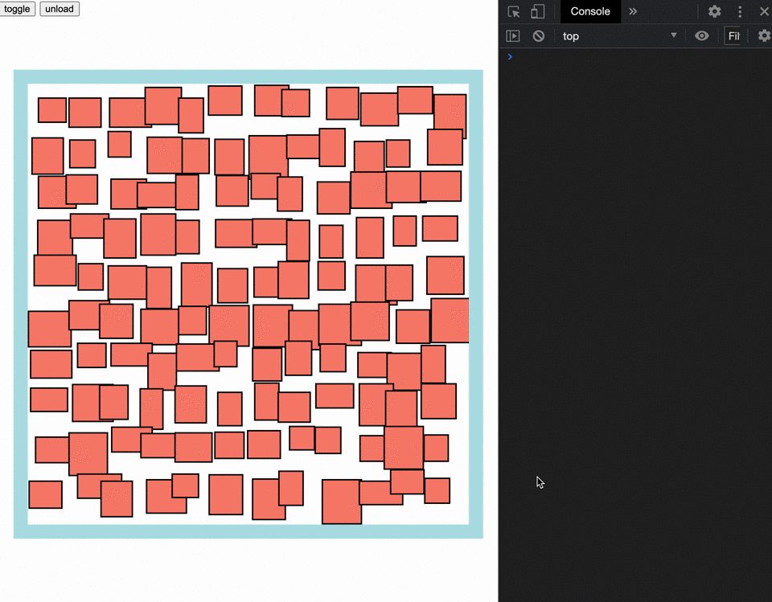
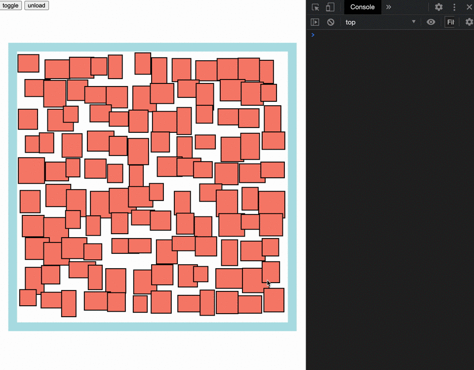
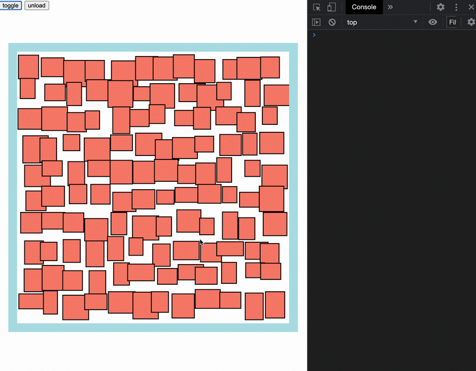

# Pika9.js


## Installation

```shell
npm install pika9
# or
yarn add pika9
```

## Example

```js
import Pika9 from 'pika9'

const pika9 = new Pika9({
  parent: '#wrapper',
  children: ['.item'],
  mode: 'toggle',
  threshold: 200,
  cleanOnClick: true,
  onStart: ev => console.log('start', ev),
  onHold: ev => console.log('holding', ev),
  onEnd: ev => console.log('end', ev)
})

pika9.enable()
```

### mode

* **toggle**

  

* **append**

  

* **disposable**

  

## Run demo

```shell
npm run build --environment TARGET:demo
# or
yarn build --environment TARGET:demo
```

open `index.html` from `/dist-demo/index.html`

